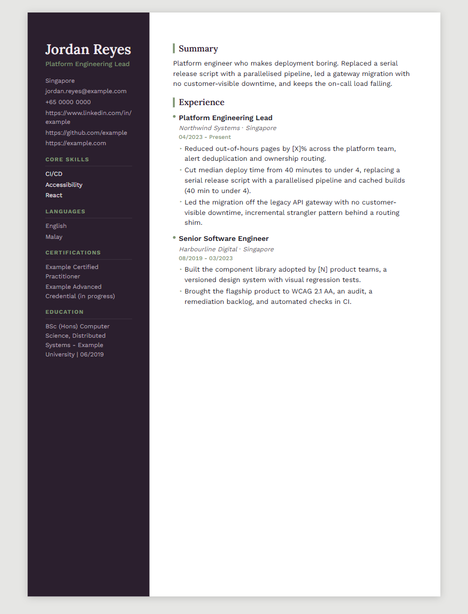

# cv-tailor

[](https://github.com/alvintayzhenwei/cv-tailor/actions/workflows/ci.yml)
[](https://github.com/alvintayzhenwei/cv-tailor/actions/workflows/audit.yml)
[](https://github.com/alvintayzhenwei/cv-tailor/actions/workflows/codeql.yml)
[](tests/)
[](LICENSE)

<!--
Workflow badges read live from Actions and show "no status" until each has run on
main. The test count is static, which is how a number goes quietly stale — so
tests/test_packaging.py::test_the_readme_test_count_badge_is_current reads
pytest's own collection and fails if the badge disagrees.
-->

A job description in, a tailored application kit out: scorecard, one-page CV, gap plan,
interview questions.

It **selects from a corpus of your own career evidence**. It never writes a claim you did
not write, and never invents a number.



> Every name, figure and contact detail above is invented. The screenshot is generated from
> `career-corpus.example.yaml`, never from a real corpus.

## Your corpus never enters this repository

`career-corpus.yaml` is gitignored, and `.gitignore` is the first commit in this history so
there was no window without it. Generated kits are ignored too — a kit embeds corpus content
in a rendered CV. Neither is un-leaked by a later deletion; git keeps history.

Four guards: the ignore rules, a pre-push hook that inspects the tip being pushed, a CI job
that fails if anything corpus-shaped is tracked, and a test.

## Use

```bash
uv sync --extra dev
cp career-corpus.example.yaml career-corpus.yaml   # then fill it in
uv run python -m cv_tailor.cli validate            # says what is still missing
uv run python -m cv_tailor.cli templates           # list layouts
uv run python -m cv_tailor.cli tailor jd.txt --template rail --out kits/acme
```

Output: `cv.md`, `cv.docx`, `cv.html`, `scorecard.md`, `gaps.md`, `traceability.md`,
`placeholders.md`.

## Layouts

| | Direction | Channel |
|---|---|---|
| `ledger` | Engineering notebook. Ruled records, dates in a column, oxblood | Portal |
| `signal` | Dense, engineered. One typeface, teal markers | Portal · default |
| `keystone` | Solid name band, slab headings, deep blue | Portal |
| `atelier` | Editorial. Asymmetric margins, brass on blush | Human |
| `rail` | Sidebar. Aubergine and sage | Human |

**Portal** layouts are single column with no sidebar, icons or images — submit those.
**Human** layouts look better by doing what a parser mishandles, so send them to a person
directly. No layout carries a photograph: it invites discrimination screening and is
stripped by many employers. The CLI names the channel on every run.

## The contract

The engine may select, compress, re-order and re-word corpus entries, and may adopt a
posting's exact wording where the corpus declares it as an alias of a skill you hold.

It may not author a claim the corpus lacks, introduce a skill you do not have, or replace an
unverified metric with a guess. Unverified figures render as `[X]` and are listed for you to
fill in. Before writing, an audit checks every claim traces to a corpus entry id.

Enforced mechanically: every metric declares `verified: true` with a value, or
`verified: false` with a placeholder and no number. The validator exits non-zero otherwise,
so the rule is a build failure rather than a prompt.

**The limit:** the validator enforces a metric's *shape*, not its truth. Nothing stops you
marking a fabricated figure verified. Traceability is the only real mitigation.

## On ATS

The "75% auto-rejected" figure traces to a 2012 sales pitch by a company gone by 2013;
recruiter surveys say rejection is overwhelmingly manual. So this optimises for what actually
gates an application: **parsing** (the only hard gate, hence the generated `.docx`),
**keyword search**, and **an LLM reader** that rewards specificity and detects stuffing.
Bullets follow the XYZ form — accomplished X, measured by Y, by doing Z.

## Security

Dependabot (`uv` and actions), weekly CodeQL, `pip-audit` against the resolved lockfile,
dependency review. Actions pinned to commit SHAs.

Three are repository settings this repo cannot enable for itself — *Settings → Code
security*: **Dependabot alerts**, **Dependabot security updates**, **secret scanning push
protection**.

**No CODEOWNERS file, deliberately.** GitHub never lets a PR author approve their own PR, so
with *Require review from Code Owners* on and one maintainer, a CODEOWNERS file naming that
maintainer makes every PR unmergeable. With no file, no path has an owner and the rule has
nothing to require.

Required status checks to add once they have run: `Lint and test`,
`No corpus or kit is tracked`, `pip-audit`.

## Status

Early. The corpus schema and validator came first: a structured, validated career history is
useful on its own.

## Licence

MIT.
